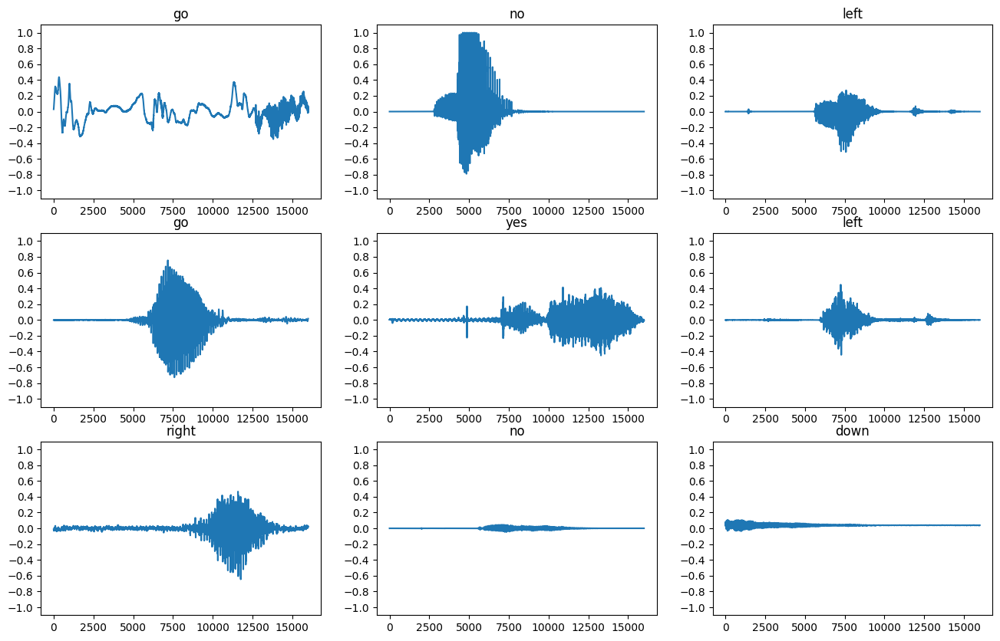
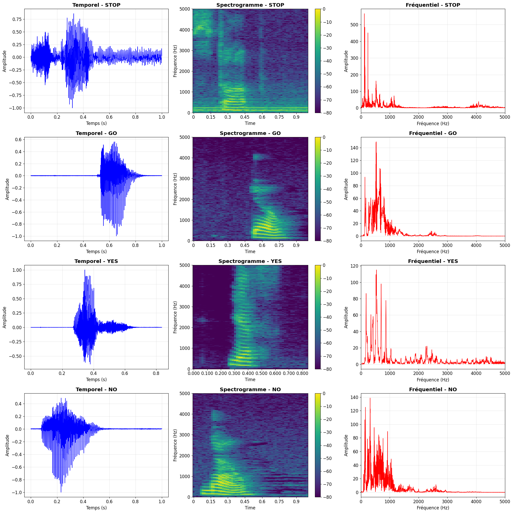

# Speech Recognition with Deep Learning

A  real-time speech recognition system built with PyTorch and EfficientNet, trained on the Google Speech Commands dataset to classify 35 different spoken words and commands with live audio processing capabilities.

## Overview

This project implements an audio classification model using transfer learning with EfficientNet-B0 as the backbone. The system converts audio signals into mel-spectrograms and processes them through a deep neural network for speech command recognition. Includes a real-time interface with GPU acceleration for live voice detection.


## Model Selection

The architecture selection process involved comparative analysis of several convolutional neural networks. EfficientNet-B0 was chosen based on its optimal balance between computational efficiency and recognition accuracy for this specific task. Alternative architectures were evaluated during development, with EfficientNet-B0 demonstrating superior performance in handling the spectral characteristics of audio commands.

## Features

### Core Model
- **Transfer Learning**: Leverages pre-trained EfficientNet-B0 for feature extraction
- **Advanced Augmentation**: Time stretching, pitch shifting, noise injection, and SpecAugment
- **Regularization**: Comprehensive dropout strategy and label smoothing
- **Training Optimization**: Early stopping, learning rate scheduling with warm restarts, and mixup augmentation
- **Model Export**: Supports both PyTorch (.pth) and ONNX formats

### Real-Time Interface
- **Live Audio Processing**: Real-time voice command detection with PyAudio integration
- **GPU Acceleration**: CUDA/DirectML support via ONNX Runtime
- **Professional UI**: Modern PyQt6 interface with dark theme and visual feedback
- **Smart Detection**: Voice Activity Detection (VAD), temporal smoothing, and configurable confidence thresholds

## Technical Approach

### Audio Processing Pipeline
Input audio signals are transformed into mel-spectrograms for analysis by the deep learning model.


### Signal Analysis
The system processes both temporal and frequency domain representations of audio signals.




## Architecture

```
Input Audio (16kHz, 1 second)
    ↓
Mel-Spectrogram (128 mel bands, 1024 FFT)
    ↓
EfficientNet-B0 Backbone (Transfer Learning)
    ↓
Progressive Dropout Classifier (1024→512→256→35)
    ↓
35 Class Output (Softmax)
```

## Requirements

```
torch==2.6.0+cu126
torchaudio==2.6.0+cu126
torchvision==0.21.0+cu126
timm==1.0.19
numpy==2.1.3
matplotlib==3.10.0
seaborn==0.13.2
scikit-learn==1.6.1
tqdm==4.67.1
onnxruntime==1.21.0
PyQt6
pyaudio==0.2.14

```

## Installation

```bash
# Clone the repository
git clone https://github.com/yourusername/speech-recognition.git
cd speech-recognition

# Install dependencies
pip install -r requirements.txt

# For PyAudio on Windows
pip install pipwin
pipwin install pyaudio
```

## Dataset

The model is trained on the [Google Speech Commands Dataset v0.02](http://download.tensorflow.org/data/speech_commands_v0.02.tar.gz):
- **105,829 audio files** across training, validation, and test sets
- **35 command words**: backward, bed, bird, cat, dog, down, eight, five, follow, forward, four, go, happy, house, learn, left, marvin, nine, no, off, on, one, right, seven, sheila, six, stop, three, tree, two, up, visual, wow, yes, zero
- **1-second audio clips** at 16kHz sample rate
- Automatically downloaded on first run

## Usage

### Training the Model

```bash
# Open the training notebook
jupyter notebook voice_recongnision.ipynb

# Run all cells to train the model
```

**Configuration Options:**
```python
# Fast testing mode (5,000 samples)
FAST_MODE = True

# Full training mode (105,829 samples)
FAST_MODE = False
```

**Hyperparameters** (adjustable in `ModelConfig` class):
```python
learning_rate = 0.001
batch_size = 64
num_epochs = 50
dropout_rates = {
    'input': 0.2,
    'feature': 0.5,
    'classifier': 0.4
}
```

### Real-Time Voice Detection

```bash
# Launch the real-time interface
python real_time_interface.py
```

**Interface Features:**
- Click **START** to begin real-time detection
- Adjust **Threshold** slider (10-95%) to control sensitivity
- View all 35 classes with live probability updates
- Monitor detection log for detailed results
- Automatic GPU acceleration if available

### Programmatic Prediction

```python
from model import predict_audio

# Load trained model
model.load_state_dict(torch.load('best_model.pth'))

# Predict single audio file
label, confidence = predict_audio('audio.wav', model, dataset, device)
print(f"Predicted: {label} ({confidence:.2f}%)")
```

## Training Details

### Hyperparameters

| Parameter | Value | Purpose |
|-----------|-------|---------|
| Learning Rate | 0.001 | Initial learning rate |
| Batch Size | 64 (32 in fast mode) | Training batch size |
| Max Epochs | 50 | Maximum training epochs |
| Optimizer | AdamW | Optimizer with weight decay |
| Weight Decay | 0.01 | L2 regularization |
| Label Smoothing | 0.1 | Softmax smoothing |
| Early Stopping | 15 epochs | Patience parameter |

### Augmentation Pipeline

**Audio-Level Augmentation:**
- Time stretching (0.8x - 1.2x speed)
- Pitch shifting (±4 semitones)
- Gaussian noise injection
- Random gain adjustment (0.8x - 1.2x)
- Background noise mixing
- Time shifting (±0.1 seconds)

**Spectrogram-Level Augmentation:**
- Time masking (1-2 masks, 30 frames max)
- Frequency masking (1-2 masks, 15 bands max)

**Training-Level Augmentation:**
- Mixup augmentation (α=0.4, applied 50% of the time)

### Regularization Strategy

| Layer | Dropout Rate | Purpose |
|-------|--------------|---------|
| Input | 0.2 | Prevent input overfitting |
| Feature 1 | 0.5 | Strong regularization |
| Feature 2 | 0.35 | Progressive reduction |
| Feature 3 | 0.25 | Moderate regularization |
| Classifier | 0.4 | Final layer regularization |
| Drop Path | 0.2 | Stochastic depth |

## Results

### Model Performance

| Metric | Value |
|--------|-------|
| Test Accuracy | 90.96% |
| F1-Score | 0.9020 |
| Precision | 0.9080 |
| Recall | 0.8978 |

### Architecture Comparison
During development, multiple network architectures were evaluated for this speech recognition task. EfficientNet-B0 demonstrated the best performance characteristics, providing an optimal balance between inference speed and classification accuracy. The selected architecture outperformed other candidates in handling the spectral patterns of voice commands.

### Real-Time Performance

| Metric | Value |
|--------|-------|
| Inference Latency | ~30-50ms (GPU) |
| Processing FPS | 20-30 FPS |
| Memory Usage | ~500MB (model + inference) |
| Supported Devices | CUDA, DirectML, CPU |

## Project Structure

```
speech-recognition/
│
├── test.ipynb                          # Training notebook (Jupyter)
├── real_time_interface.py              # Real-time detection UI (compact)
├── real_time_optimiset.py              # Alternative real-time interface
├── datasets_download.py                # Dataset download utility
├── plot_signal.ipynb                   # Signal visualization tools
│
├── best_model.pth                      # Best model checkpoint
├── speech_recognition_model_v1.pth     # Final model weights
├── speech_recognition_model_v1.onnx    # ONNX model (23.9 MB)
├── class_labels.json                   # Label mappings
│
├── data/                               # Dataset directory (auto-created)
│   └── SpeechCommands/
│       └── speech_commands_v0.02/
│
├── image/                              # Documentation images
└── mobilnet_v3/                        # Experimental architectures
```

## Key Components

### 1. Data Processing Pipeline
```python
Audio Input (16kHz)
    → Resampling & Normalization
    → Padding/Truncation (1 second)
    → Mel-Spectrogram (128 bands)
    → Amplitude to dB conversion
    → Standardization (mean=0, std=1)
    → 3-channel replication (RGB format)
```

### 2. Model Architecture
```python
EfficientNet-B0 Backbone
    ├─ Pretrained ImageNet weights
    ├─ Feature dimension: 1280
    └─ Drop path rate: 0.2

Progressive Classifier
    ├─ Dropout(0.5) → Linear(1280→1024) → BatchNorm → GELU
    ├─ Dropout(0.35) → Linear(1024→512) → BatchNorm → GELU
    ├─ Dropout(0.25) → Linear(512→256) → BatchNorm → GELU
    └─ Dropout(0.4) → Linear(256→35) → Softmax
```

### 3. Training Pipeline
- **Early Stopping**: Monitors validation loss with patience of 15 epochs
- **Learning Rate Schedule**: Cosine annealing with warm restarts (T₀=10, T_mult=2)
- **Gradient Clipping**: Max norm of 1.0 to prevent exploding gradients
- **Mixed Precision**: Optional support for faster training

### 4. Real-Time Detection Features
- **Voice Activity Detection**: Energy-based detection with adaptive noise floor
- **Temporal Smoothing**: Exponential moving average (α=0.7) for stable predictions
- **Minimum Detection Interval**: 500ms cooldown between detections
- **GPU Acceleration**: ONNX Runtime with CUDA/DirectML providers
- **Multi-threading**: Separate threads for audio recording and processing

## Real-Time Interface

### UI Features
- **Status Bar**: Live monitoring of recording status, audio level, FPS, and GPU usage
- **Control Panel**: Start/stop recording, adjustable confidence threshold (10-95%)
- **Detection Display**: Large, highlighted current prediction with confidence
- **All Classes Grid**: 35 compact widgets (8×5 grid) with vertical progress bars
- **Detection Log**: Timestamped history of all detections
- **Floating Notifications**: Non-intrusive detection alerts

## Performance Optimization

### Training Optimizations
- Fast mode for rapid prototyping (5K samples)
- CUDA acceleration with cuDNN benchmarking
- Multi-worker data loading (num_workers=0 for Windows compatibility)
- Pin memory for faster GPU transfers
- Gradient accumulation support

### Inference Optimizations
- ONNX model quantization support
- GPU acceleration (CUDA/DirectML)
- Batch processing for multiple files
- Efficient memory management
- Real-time audio buffering (3-second circular buffer)

## Model Output Files

| File | Size | Description |
|------|------|-------------|
| `speech_recognition_model_v1.pth` | 24.3 MB | PyTorch model weights |
| `speech_recognition_model_v1.onnx` | 23.9 MB | ONNX format for deployment |
| `class_labels.json` | 485 B | Index to label mappings |
| `best_model.pth` | ~24 MB | Best validation checkpoint |

## Technical Details

### Audio Processing
- **Sample Rate**: 16,000 Hz
- **FFT Size**: 1024 points
- **Hop Length**: 256 samples
- **Mel Bands**: 128 bands (50 Hz - 8000 Hz)
- **Window**: Hann window
- **Pre-emphasis**: 0.97 coefficient

### Model Specifications
- **Total Parameters**: 5,987,999
- **Trainable Parameters**: 5,987,999
- **Input Shape**: (batch, 3, 128, 32)
- **Output Shape**: (batch, 35)
- **Inference Time**: 30-50ms (GPU), 100-150ms (CPU)

## Contributing

Contributions are welcome. Please follow these steps:

1. Fork the repository
2. Create a feature branch (`git checkout -b feature/amazing-feature`)
3. Commit your changes (`git commit -m 'Add amazing feature'`)
4. Push to the branch (`git push origin feature/amazing-feature`)
5. Open a Pull Request

## License

This project is licensed under the MIT License - see the LICENSE file for details.

## Acknowledgments

- **Google Speech Commands Dataset** - Training data
- **EfficientNet** - Architecture by Tan & Le (2019)
- **PyTorch** - Deep learning framework
- **TIMM** - PyTorch Image Models library
- **ONNX Runtime** - Cross-platform inference engine
- **PyQt6** - Professional GUI framework

## Contact

For questions, feedback, or collaboration opportunities:
- Open an issue in the GitHub repository
- Email: dhiadridi06@gmail.com


## Known Issues

- PyAudio installation may require additional steps on some systems
- CUDA/DirectML acceleration requires compatible GPU drivers
- Real-time latency varies based on hardware capabilities

## Roadmap

- [ ] Add support for custom voice commands
- [ ] Implement continuous learning from user feedback
- [ ] Add multi-language support
- [ ] Create mobile app version (TensorFlow Lite)
- [ ] Add wake word detection
- [ ] Improve noise robustness with additional augmentation

---

**Note:** This project is maintained for  educational purposes.
